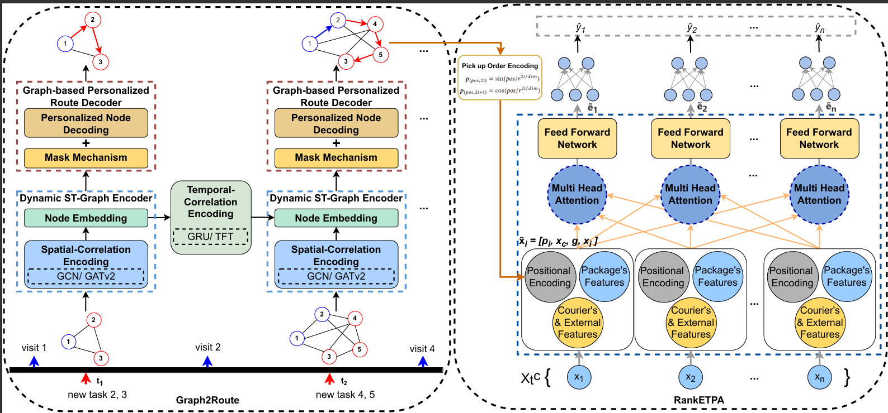

## Graph2RETA: Graph Neural Networks for Pick-up and Delivery Route Prediction and Arrival Time Estimation

## Description

This research aims to improve delivery services by tackling two main problems: inaccurate delivery routes and tricky ETA(Estimated Time of Arrival) predictions. Traditional methods often ignore real-world factors, causing planned routes to differ from actual ones. Our new method, Graph2RETA, uses a smart graph-based model to predict both delivery routes and arrival times more accurately. It considers how delivery workers move over time and space, leading to better predictions and fewer delivery issues.

## Visuals
This is the picture of our implemented model.\

## Installation
1. Install everything from requirements.txt

## Usage
Use the following command to run the code: python run_graph2reta.py

## Repo Structure
The structure of our code and description of important files are given as follows:

- **data/dataset/**:
  - **food_pd/**: Food_PD data
- **evaluation/**:
  - **eval_route.py**: Implementation of the evaluation metrics for graph2route
  - **eval_etpa.py**: Implementation of the evaluation metrics for ranketpa
- **models/**:
  - **graph2route/**: Code of graph2route for pick-up route prediction 
  - **ranketpa/**: Code of ranketpa for arrival time estimation
- **utils/**:
  - **utils.py**
- **run_graph2reta.py**: Main function of this project, mainly used for training and evaluating different models

## Acknowledgement
We would like to extend our gratitude to the authors of the following papers, whose groundbreaking work has greatly inspired and informed our project:
1. Wen, H., Lin, Y., Mao, X., Wu, F., Zhao, Y., Wang, H., Zheng, J., Wu, L., Hu,H., Wan, H.: Graph2route: A dynamic spatial-temporal graph neural network for pick-up and delivery route prediction. In: Proceedings of the 28th ACM SIGKDD Conference on Knowledge Discovery and Data Mining. pp. 4143–4152 (2022) (https://github.com/wenhaomin/graph2route)
2. Wen, H., Lin, Y., Wu, F., Wan, H., Sun, Z., Cai, T., Liu, H., Guo, S., Zheng, J., Song, C., et al.: Enough waiting for the couriers: Learning to estimate package pick-up arrival time from couriers’ spatial-temporal behaviors. ACM Transactions on Intelligent Systems and Technology 14(3), 1–22 (2023)
